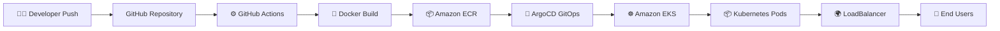

<div align="center">


# ☁️ Enterprise Cloud Native DevOps Platform

### 🚀 GitHub Actions • Terraform • Docker • ArgoCD • Amazon EKS

<p align="center">
Production-Grade GitOps CI/CD Pipeline on AWS Cloud Infrastructure
</p>


</div>

---

# 📌 Project Overview

This project demonstrates a complete **Enterprise DevOps Workflow** deployed on AWS using modern cloud-native technologies.

The infrastructure is fully provisioned using **Terraform**, the application is containerized with **Docker**, deployed on **Amazon EKS**, automated through **GitHub Actions**, and continuously synchronized using **ArgoCD GitOps**.

The goal of this project is to simulate a real-world production-grade DevOps environment with:

* Infrastructure as Code (IaC)
* CI/CD Automation
* GitOps Deployment Strategy
* Kubernetes Orchestration
* Cloud-Native Architecture
* Scalable Containerized Deployment

---

---

---

# 🏛️ Enterprise Architecture Overview

<div align="center">

### End-to-End GitOps CI/CD Workflow on AWS

</div>


---

# ☁️ AWS Infrastructure Architecture


---
# ☁️ AWS Services Used

| AWS Service | Purpose |
|---|---|
| Amazon EKS | Kubernetes Cluster |
| Amazon ECR | Container Registry |
| Amazon EC2 | Bastion / Management Server |
| Amazon S3 | Terraform Backend |
| IAM | Permissions Management |
| VPC | Networking |
| Load Balancer | Application Exposure |
| NAT Gateway | Private Subnet Internet Access |
# 🧱 Infrastructure as Code (Terraform)
---
The infrastructure is provisioned using reusable Terraform modules.

## 📂 Terraform Modules

```text
Terraform Modules
│
├── VPC
├── Public & Private Subnets
├── Internet Gateway
├── NAT Gateway
├── Route Tables
├── Security Groups
├── IAM Roles
├── Amazon EKS
├── Amazon ECR
├── EC2 Instance
└── S3 Remote Backend
```

---

# 🗂️ Project Structure

```bash
.
├── ansible
├── app
├── argocd-app.yaml
├── k8s
└── terraform
```

---

# ⚙️ Technologies Used

| Category                 | Technologies     |
| ------------------------ | ---------------- |
| Cloud Provider           | AWS              |
| Infrastructure as Code   | Terraform        |
| Containerization         | Docker           |
| Container Registry       | Amazon ECR       |
| Orchestration            | Kubernetes (EKS) |
| CI/CD                    | GitHub Actions   |
| GitOps                   | ArgoCD           |
| Configuration Management | Ansible          |
| Backend State            | Amazon S3        |

---

# 🔄 CI/CD Pipeline Workflow

## 🚀 Continuous Integration (CI)

GitHub Actions automates the CI process:

1. Trigger workflow on push to `master`
2. Checkout source code
3. Authenticate with AWS
4. Build Docker image
5. Push image to Amazon ECR

---
---

# 🔄 GitOps Deployment Strategy

This project follows the GitOps methodology where:

✅ GitHub Repository acts as the Single Source of Truth  
✅ ArgoCD continuously monitors Kubernetes manifests  
✅ Infrastructure and deployments remain declarative  
✅ Automatic synchronization maintains desired cluster state  
✅ Rollbacks become easier and safer

## 🔁 Continuous Deployment (CD)

ArgoCD continuously monitors the GitHub repository:

1. Detects Kubernetes manifest changes
2. Syncs automatically with EKS cluster
3. Deploys updated application
4. Maintains desired cluster state

---

# 🐳 Docker Containerization

The application is containerized using Docker.

## Docker Workflow

```text
Source Code → Docker Build → Docker Image → Amazon ECR → Kubernetes Deployment
```

---

# ☸️ Kubernetes Deployment

The application is deployed on Amazon EKS using:

* Namespace
* Deployment
* Service
* Ingress
* Replicas
* LoadBalancer

## Kubernetes Components

| Component  | Purpose                     |
| ---------- | --------------------------- |
| Namespace  | Isolate resources           |
| Deployment | Manage application replicas |
| Service    | Internal communication      |
| Ingress    | External routing            |
| Pods       | Run application containers  |

---

# 🔐 ArgoCD GitOps Deployment

ArgoCD provides GitOps-based continuous deployment.

## GitOps Flow

```text
Developer Push → GitHub Repository Updated
        ↓
ArgoCD Detects Changes
        ↓
Sync Kubernetes Manifests
        ↓
Deploy Updated Application
```

---

# 📸 Project Screenshots

# ✅ GitHub Actions Pipeline


---

# ✅ ArgoCD Login Page

> 📍 PLACE YOUR ARGOCD LOGIN SCREENSHOT HERE

---

# ✅ ArgoCD Dashboard


---

# ✅ ArgoCD Application Tree


---

# ✅ Amazon EKS Cluster


---

# ✅ Amazon ECR Repository


---

# ✅ Amazon S3 Backend


---

# ✅ Running Application


---

# 🌍 Application Access

## Application URL

```text
ADD YOUR LOAD BALANCER URL HERE
```

## ArgoCD URL

```text
ADD YOUR ARGOCD URL HERE
```

---

# 🪣 Terraform Remote Backend (S3)

Terraform state management is configured using:

* Amazon S3 Backend
* Remote Terraform State
* Centralized State Management

Benefits:

* Team collaboration
* Secure state storage
* State consistency
* Easier infrastructure management

---

# 📜 GitHub Actions Workflow

```yaml
name: Deploy to EKS

on:
  push:
    branches:
      - master
```

---

# 🛠️ Deployment Steps

## 1️⃣ Clone Repository

```bash
git clone <repo-url>
cd CloudDevOpsProject
```

## 2️⃣ Initialize Terraform

```bash
terraform init
```

## 3️⃣ Deploy Infrastructure

```bash
terraform apply
```

## 4️⃣ Configure kubectl

```bash
aws eks update-kubeconfig --region eu-north-1 --name <cluster-name>
```

## 5️⃣ Deploy Kubernetes Resources

```bash
kubectl apply -f k8s/
```

## 6️⃣ Install ArgoCD

```bash
kubectl create namespace argocd
```

---

# 📈 Future Improvements

* Prometheus Monitoring
* Grafana Dashboards
* Helm Charts
* SSL/TLS with ACM
* Domain Name Integration
* Blue/Green Deployment
* Horizontal Pod Autoscaling

---

# 👩‍💻 Author

## Zakya Akram

Cloud & DevOps Engineer

---

# ⭐ Final Result

# 🏁 Project Achievement

This project successfully demonstrates a complete enterprise-grade DevOps lifecycle using modern cloud-native technologies on AWS.

From infrastructure provisioning → containerization → CI/CD automation → GitOps deployment → Kubernetes orchestration, the entire workflow is fully automated and production-oriented.

🚀 Built with scalability, automation, and DevOps best practices in mind.

---

<div align="center">

### 🚀 Enterprise DevOps Project using AWS Cloud Native Technologies

</div>
