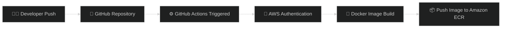
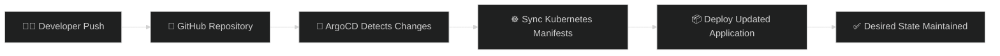

<div align="center">


<br>


<br><br>


<br><br>


<br><br>


</div>

<br>

<div align="center">

### 🔹 Enterprise Cloud Infrastructure • GitOps Automation • Kubernetes Orchestration • CI/CD Pipeline

</div>

<br>

# 📌 Project Overview

This project demonstrates a complete **Enterprise DevOps & GitOps Workflow** deployed on AWS using modern cloud-native technologies.

The infrastructure is fully provisioned using **Terraform**, the application is containerized with **Docker**, deployed on **Amazon EKS**, automated through **GitHub Actions**, and continuously synchronized using **ArgoCD GitOps**.

The platform simulates a real-world **production-grade cloud-native DevOps ecosystem** focused on:

- ☁️ Infrastructure Automation
- ⚙️ CI/CD Pipeline Automation
- ☸️ Kubernetes Orchestration
- 🔄 GitOps Continuous Deployment
- 🐳 Containerized Workloads
- 🚀 Scalable Cloud Architecture

<br>


# ✨ Platform Highlights

<div align="center">

| 🚀 Feature | ✅ Status |
|---|---|
| Automated CI/CD Pipeline | ✔️ |
| GitOps Continuous Deployment | ✔️ |
| Kubernetes-Based Architecture | ✔️ |
| Dockerized Application Delivery | ✔️ |
| Amazon ECR Integration | ✔️ |
| Terraform Modular Infrastructure | ✔️ |
| Remote Terraform State (S3) | ✔️ |
| ArgoCD Auto Sync & Self-Healing | ✔️ |

</div>

<br>


# 🏛️ Enterprise Architecture Overview

<div align="center">

## ☁️ End-to-End GitOps CI/CD Workflow


</div>

<br>


<br>


# ☁️ AWS Infrastructure Architecture

<div align="center">

## 🏗️ Production-Style AWS Infrastructure

<br>


</div>

<br>


# ☁️ AWS Services Used

<div align="center">

| AWS Service | Purpose |
|---|---|
| ☸️ Amazon EKS | Kubernetes Cluster Orchestration |
| 📦 Amazon ECR | Container Image Registry |
| 🖥️ Amazon EC2 | Bastion / Management Server |
| 🪣 Amazon S3 | Terraform Remote Backend |
| 🔐 IAM | Identity & Access Management |
| 🌐 Amazon VPC | Cloud Networking Infrastructure |
| 🌍 AWS Load Balancer | External Application Exposure |
| 🚪 NAT Gateway | Internet Access for Private Subnets |

</div>

<br>


# 🧱 Infrastructure as Code (Terraform)

<div align="center">

## ☁️ Modular AWS Infrastructure using Terraform


</div>

<br>

The AWS infrastructure is provisioned using a **modular Terraform architecture** following Infrastructure as Code (IaC) best practices.

<br>

## 📂 Terraform Modules Structure

```text
terraform/
│
├── modules/
│   ├── network/
│   ├── security-groups/
│   ├── iam/
│   ├── eks/
│   ├── ecr/
│   └── ec2/
│
└── environments/
    └── dev/
```

<br>


# ⚙️ Technologies Used

<div align="center">

| Category | Technology |
|---|---|
| ☁️ Cloud Provider | AWS |
| 🏗️ Infrastructure as Code | Terraform |
| 🐳 Containerization | Docker |
| 📦 Container Registry | Amazon ECR |
| ☸️ Orchestration | Kubernetes (EKS) |
| ⚙️ CI/CD | GitHub Actions |
| 🔄 GitOps | ArgoCD |
| 🛠️ Configuration Management | Ansible |
| 🪣 Backend State | Amazon S3 |

</div>

<br>


# 🔄 CI/CD & GitOps Workflow

<div align="center">

## 🚀 Fully Automated Enterprise Deployment Pipeline


</div>

<br>

# ⚙️ Continuous Integration (CI)

The CI pipeline is fully automated using **GitHub Actions**.

Every push to the `master` branch automatically triggers the deployment workflow.

<br>

## 🚀 CI Pipeline Flow



<br>


# 🔄 GitOps Deployment Strategy

<div align="center">

## ☁️ GitHub Repository as the Single Source of Truth

</div>

<br>

ArgoCD continuously monitors Kubernetes manifests stored in GitHub and automatically synchronizes them with the EKS cluster.

<br>

## ✨ GitOps Benefits

✅ Declarative Kubernetes Deployments  
✅ Automatic Synchronization  
✅ Self-Healing Infrastructure  
✅ Easier Rollbacks  
✅ Git-Based Change Tracking  
✅ Fully Automated Delivery

<br>


# ☸️ Kubernetes Deployment

<div align="center">

## ☁️ Scalable Kubernetes Workloads on Amazon EKS

</div>

<br>

## 🚀 Kubernetes Resources

<div align="center">

| Resource | Purpose |
|---|---|
| 📦 Namespace | Resource Isolation |
| 🚀 Deployment | Replica Management |
| 🌐 Service | Internal & External Communication |
| 🔀 Ingress | HTTP Routing |
| 📄 Pods | Run Containerized Application |
| ⚖️ LoadBalancer | Public Access |

</div>

<br>


# 🔐 ArgoCD GitOps Deployment

<div align="center">

## 🔄 Continuous GitOps Deployment using ArgoCD


</div>

<br>



<br>


# 📸 Project Screenshots

<div align="center">

## ⚙️ GitHub Actions Pipeline


<br><br>

## 🔄 ArgoCD Application Tree


<br><br>

## 🚀 Running Application


</div>


# 🪣 Terraform Remote Backend (S3)

<div align="center">

## ☁️ Centralized Terraform State Management

</div>

<br>

Terraform remote state management is configured using **Amazon S3 Backend** to provide secure and centralized infrastructure state storage.

<br>

## ✨ S3 Backend Benefits

✅ Centralized Terraform State  
✅ Improved Team Collaboration  
✅ Persistent Infrastructure State  
✅ Better State Consistency  
✅ Production-Style Terraform Workflow

<br>


# 🚀 Deployment Steps

## 1️⃣ Clone Repository

```bash
git clone <repo-url>
cd CloudDevOpsProject
```

## 2️⃣ Initialize Terraform

```bash
terraform init
```

## 3️⃣ Provision AWS Infrastructure

```bash
terraform apply
```

## 4️⃣ Configure kubectl

```bash
aws eks update-kubeconfig --region eu-north-1 --name <cluster-name>
```

## 5️⃣ Deploy Kubernetes Resources

```bash
kubectl apply -f k8s/
```

## 6️⃣ Install ArgoCD

```bash
kubectl create namespace argocd

kubectl apply -n argocd -f https://raw.githubusercontent.com/argoproj/argo-cd/stable/manifests/install.yaml
```

<br>


# 📈 Future Improvements

<div align="center">

| Enhancement | Status |
|---|---|
| 📊 Prometheus Monitoring | Planned |
| 📈 Grafana Dashboards | Planned |
| 📦 Helm Charts | Planned |
| 🔒 SSL/TLS with ACM | Planned |
| 🌍 Domain Name Integration | Planned |
| 🔄 Blue/Green Deployment | Planned |
| ⚖️ Horizontal Pod Autoscaling | Planned |

</div>

<br>


# 👩‍💻 Author

<div align="center">

# Zakya Akram

### ☁️ Cloud & DevOps Engineer


<br><br>

### 🚀 Built with Scalability, Automation & DevOps Best Practices

<br>


</div>
