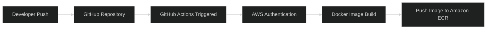
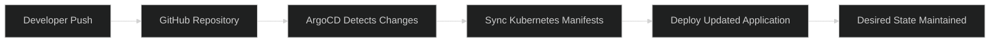

<div align="center">


<br><br>


<br><br>


<br><br>


</div>

<br>

<div align="center">

###  Enterprise Cloud Infrastructure • Kubernetes Orchestration • GitOps Automation

</div>

<br>


# Project Overview

This project demonstrates a complete **Enterprise DevOps & GitOps Workflow** deployed on AWS using modern cloud-native technologies.

The infrastructure is fully provisioned using **Terraform**, the application is containerized with **Docker**, deployed on **Amazon EKS**, automated through **GitHub Actions**, and continuously synchronized using **ArgoCD GitOps**.

The platform simulates a real-world production-grade cloud-native DevOps ecosystem focused on:

-  Infrastructure Automation
-  CI/CD Pipeline Automation
-  Kubernetes Orchestration
-  GitOps Continuous Deployment
-  Containerized Workloads
-  Scalable Cloud Architecture

<br>

<div align="center">

| Feature | ✅ Status |
|---|---|
| Automated CI/CD Pipeline | ✔️ |
| GitOps Continuous Deployment | ✔️ |
| Kubernetes-Based Architecture | ✔️ |
| Dockerized Application Delivery | ✔️ |
| Amazon ECR Integration | ✔️ |
| Terraform Modular Infrastructure | ✔️ |
| Remote Terraform State (S3) | ✔️ |
| ArgoCD Auto Sync & Self-Healing | ✔️ |

</div>

<br>


#  Enterprise Architecture Overview

<div align="center">


</div>

<br>


<br>


# AWS Infrastructure Architecture

<div align="center">


</div>

<br>

<div align="center">

| AWS Service | Purpose |
|---|---|
|  Amazon EKS | Kubernetes Cluster Orchestration |
|  Amazon ECR | Container Image Registry |
|  Amazon EC2 | Bastion / Management Server |
|  Amazon S3 | Terraform Remote Backend |
|  IAM | Identity & Access Management |
|  Amazon VPC | Cloud Networking Infrastructure |
|  AWS Load Balancer | External Application Exposure |
|  NAT Gateway | Internet Access for Private Subnets |

</div>

<br>


#  Infrastructure as Code (Terraform)

<div align="center">


</div>

<br>

The AWS infrastructure is provisioned using a **modular Terraform architecture** following Infrastructure as Code (IaC) best practices.

<br>

##  Terraform Modules Structure

```text
terraform/
│
├── modules/
│   ├── network/
│   ├── security-groups/
│   ├── iam/
│   ├── eks/
│   ├── ecr/
│   └── ec2/
│
└── environments/
    └── dev/
```

<br>

<div align="center">

| Category | Technology |
|---|---|
|  Cloud Provider | AWS |
|  Infrastructure as Code | Terraform |
|  Containerization | Docker |
|  Container Registry | Amazon ECR |
|  Orchestration | Kubernetes (EKS) |
|  CI/CD | GitHub Actions |
|  GitOps | ArgoCD |
|  Configuration Management | Ansible |
|  Backend State | Amazon S3 |

</div>

<br>


# CI/CD & GitOps Workflow [](https://github.com/zakyaakram/CloudDevOpsProject/actions/workflows/deploy.yml)

<div align="center">


</div>

<br>

##  Continuous Integration (CI)

The CI pipeline is fully automated using **GitHub Actions**.

Every push to the `master` branch automatically triggers the deployment workflow.

<br>



<br>

##  GitOps Deployment Strategy

ArgoCD continuously monitors Kubernetes manifests stored in GitHub and automatically synchronizes them with the EKS cluster.

<br>

### GitOps Benefits

- ✅ Declarative Kubernetes Deployments
- ✅ Automatic Synchronization
- ✅ Self-Healing Infrastructure
- ✅ Easier Rollbacks
- ✅ Git-Based Change Tracking
- ✅ Fully Automated Delivery

<br>


# Kubernetes Deployment

<div align="center">

| Resource | Purpose |
|---|---|
|  Namespace | Resource Isolation |
|  Deployment | Replica Management |
|  Service | Internal & External Communication |
|  Ingress | HTTP Routing |
|  Pods | Run Containerized Application |
|  LoadBalancer | Public Access |

</div>

<br>



<br>


#  Project Screenshots

<div align="center">

## GitHub Actions Pipeline


<br><br>

##  ArgoCD Application Tree


<br><br>

##  Running Application


</div>


#  Terraform Remote Backend (S3)

Terraform remote state management is configured using **Amazon S3 Backend** to provide secure and centralized infrastructure state storage.

<br>

###  S3 Backend Benefits

- ✅ Centralized Terraform State
- ✅ Improved Team Collaboration
- ✅ Persistent Infrastructure State
- ✅ Better State Consistency
- ✅ Production-Style Terraform Workflow

<br>


#  Deployment Steps

## 1️⃣ Clone Repository

```bash
git clone <repo-url>
cd CloudDevOpsProject
```

## 2️⃣ Initialize Terraform

```bash
terraform init
```

## 3️⃣ Provision AWS Infrastructure

```bash
terraform apply
```

## 4️⃣ Configure kubectl

```bash
aws eks update-kubeconfig --region eu-north-1 --name <cluster-name>
```

## 5️⃣ Deploy Kubernetes Resources

```bash
kubectl apply -f k8s/
```

## 6️⃣ Install ArgoCD

```bash
kubectl create namespace argocd

kubectl apply -n argocd -f https://raw.githubusercontent.com/argoproj/argo-cd/stable/manifests/install.yaml
```

<br>


#  Future Improvements

<div align="center">

| Enhancement | Status |
|---|---|
|  Prometheus Monitoring | Planned |
|  Grafana Dashboards | Planned |
|  Helm Charts | Planned |
|  SSL/TLS with ACM | Planned |
|  Domain Name Integration | Planned |
|  Blue/Green Deployment | Planned |
|  Horizontal Pod Autoscaling | Planned |

</div>

<br>


# 👩‍💻 Author

<div align="center">

# Zakya Akram

### Cloud & DevOps Engineer


<br>

### 🚀 Built with Scalability, Automation & DevOps Best Practices


</div>
