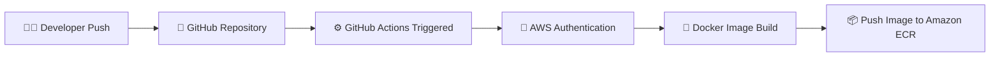
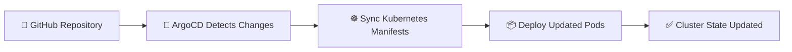
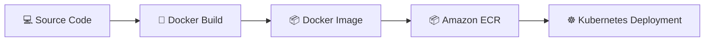
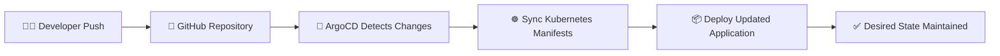

<div align="center">


### 🚀 GitHub Actions • Terraform • Docker • ArgoCD • Amazon EKS

<p align="center">
Production-Grade GitOps CI/CD Pipeline on AWS Cloud Infrastructure
</p>

<br>

<p align="center">


</p>

<br>

## ⚡ Fully Automated Cloud-Native DevOps Lifecycle

```text
Code → Build → Containerize → Push → GitOps Sync → Deploy → Kubernetes
```

</div>

---

# 📌 Project Overview

This project demonstrates a complete **Enterprise DevOps & GitOps Workflow** deployed on AWS using modern cloud-native technologies.

The infrastructure is fully provisioned using **Terraform**, the application is containerized with **Docker**, deployed on **Amazon EKS**, automated through **GitHub Actions**, and continuously synchronized using **ArgoCD GitOps**.

The project simulates a real-world **production-grade DevOps environment** focused on automation, scalability, and cloud-native deployment practices.

---

# ✨ Core Objectives

| Objective | Description |
|---|---|
| 🏗️ Infrastructure as Code | Provision AWS infrastructure using reusable Terraform modules |
| ⚙️ CI/CD Automation | Automate Docker build & deployment workflows |
| ☸️ Kubernetes Orchestration | Deploy scalable workloads on Amazon EKS |
| 🔄 GitOps Deployment | Continuous synchronization using ArgoCD |
| ☁️ Cloud-Native Architecture | Design production-style AWS infrastructure |
| 🚀 Scalable Platform | Modular and extensible DevOps environment |

---

# 🔥 Platform Highlights

✅ Fully Automated CI/CD Pipeline  
✅ GitOps Continuous Deployment  
✅ Kubernetes-Based Architecture  
✅ Amazon ECR Integration  
✅ Terraform Modular Infrastructure  
✅ Remote Terraform State using S3  
✅ Production-Style AWS Networking  
✅ ArgoCD Auto-Sync & Self-Healing

---
---

# 🏛️ Enterprise Architecture Overview

<div align="center">

### ☁️ End-to-End GitOps CI/CD Workflow on AWS Cloud Infrastructure


</div>

<br>


---

# ☁️ AWS Infrastructure Architecture

<div align="center">

### 🏗️ Production-Style AWS Cloud Infrastructure


</div>

---

# ☁️ AWS Services Used

<div align="center">

| AWS Service | Purpose |
|---|---|
| ☸️ Amazon EKS | Kubernetes Cluster Orchestration |
| 📦 Amazon ECR | Container Image Registry |
| 🖥️ Amazon EC2 | Bastion / Management Server |
| 🪣 Amazon S3 | Terraform Remote Backend |
| 🔐 IAM | Identity & Access Management |
| 🌐 Amazon VPC | Cloud Networking Infrastructure |
| 🌍 AWS Load Balancer | External Application Exposure |
| 🚪 NAT Gateway | Internet Access for Private Subnets |

</div>

---

# 🔥 Infrastructure Highlights

✅ Public & Private Subnet Architecture  
✅ Secure IAM Roles & Security Groups  
✅ Highly Available Kubernetes Cluster  
✅ Production-Style AWS Networking  
✅ Centralized Terraform Remote State  
✅ Cloud-Native GitOps Deployment Workflow

---
# 🧱 Infrastructure as Code (Terraform)

<div align="center">

### ☁️ Modular AWS Infrastructure Provisioned using Terraform


</div>

---

The entire AWS infrastructure is provisioned using **modular Terraform architecture** following Infrastructure as Code (IaC) best practices.

Each AWS component is separated into reusable modules to improve:

- ✅ Scalability
- ✅ Maintainability
- ✅ Reusability
- ✅ Clean Infrastructure Design

---

# 📂 Terraform Modules Structure

```text
terraform/
│
├── modules/
│   │
│   ├── network/
│   │   ├── VPC
│   │   ├── Public & Private Subnets
│   │   ├── Internet Gateway
│   │   ├── NAT Gateway
│   │   └── Route Tables
│   │
│   ├── security-groups/
│   │
│   ├── iam/
│   │
│   ├── eks/
│   │
│   ├── ecr/
│   │
│   └── ec2/
│
└── environments/
    └── dev/
```

---

# ☁️ Provisioned AWS Resources

<div align="center">

| Resource | Purpose |
|---|---|
| 🌐 VPC | Isolated cloud network |
| 📡 Public & Private Subnets | Network segmentation |
| 🚪 Internet Gateway | Public internet access |
| 🔄 NAT Gateway | Internet access for private subnets |
| 🛣️ Route Tables | Traffic routing management |
| 🔐 Security Groups | Firewall & access control |
| 👤 IAM Roles | AWS permissions management |
| ☸️ Amazon EKS | Kubernetes cluster |
| 📦 Amazon ECR | Docker image registry |
| 🖥️ Amazon EC2 | Bastion / management server |
| 🪣 Amazon S3 | Remote Terraform backend |

</div>

---

# 🗂️ Project Structure

<div align="center">

### 📦 Organized Enterprise DevOps Repository Structure

</div>

```bash
.
├── ansible/
├── app/
├── argocd-app.yaml
├── k8s/
└── terraform/
```

---

# ⚙️ Technologies Used

<div align="center">

| Category | Technology |
|---|---|
| ☁️ Cloud Provider | AWS |
| 🏗️ Infrastructure as Code | Terraform |
| 🐳 Containerization | Docker |
| 📦 Container Registry | Amazon ECR |
| ☸️ Orchestration | Kubernetes (EKS) |
| ⚙️ CI/CD | GitHub Actions |
| 🔄 GitOps | ArgoCD |
| 🛠️ Configuration Management | Ansible |
| 🪣 Backend State | Amazon S3 |

</div>

---

# 🚀 Infrastructure Highlights

✅ Modular Terraform Architecture  
✅ Reusable Infrastructure Components  
✅ Production-Style AWS Networking  
✅ Remote Terraform State Management  
✅ Kubernetes-Ready Infrastructure  
✅ Secure IAM & Networking Configuration

---
# 🔄 CI/CD & GitOps Workflow

<div align="center">

### 🚀 Fully Automated Enterprise Deployment Pipeline


</div>

---

# ⚙️ Continuous Integration (CI)

The CI pipeline is fully automated using **GitHub Actions**.

Every push to the `master` branch automatically triggers the workflow pipeline responsible for building and publishing the application container image.

---

## 🚀 CI Pipeline Flow



---

# 🔥 GitHub Actions Workflow

<div align="center">

| Stage | Description |
|---|---|
| 📂 Checkout Repository | Fetch latest application source code |
| 🔐 Configure AWS Credentials | Authenticate securely with AWS |
| 🐳 Build Docker Image | Build containerized application image |
| 📦 Push to Amazon ECR | Store Docker image in AWS container registry |
| 🚀 Prepare Deployment | Ready image for Kubernetes deployment |

</div>

---

# 🔄 GitOps Deployment Strategy

<div align="center">

### ☁️ GitHub Repository as the Single Source of Truth

</div>

This project follows the **GitOps methodology** where Kubernetes deployments are managed declaratively through Git.

ArgoCD continuously monitors the repository and automatically synchronizes infrastructure and application changes with the Kubernetes cluster.

---

# ✨ GitOps Benefits

✅ Declarative Kubernetes Deployments  
✅ Automatic Synchronization with Cluster  
✅ Self-Healing Infrastructure State  
✅ Easier Rollbacks & Version Control  
✅ Fully Automated Deployment Lifecycle  
✅ Git-Based Change Tracking

---

# 🔁 Continuous Deployment (CD)

ArgoCD continuously watches Kubernetes manifests stored inside the GitHub repository.

Whenever changes are detected, ArgoCD automatically synchronizes the cluster state with the desired configuration.

---

## 🔄 ArgoCD Deployment Flow



---

# 🐳 Docker Containerization

<div align="center">

### 📦 Cloud-Native Application Packaging using Docker

</div>

The application is fully containerized using Docker to ensure:

- ✅ Portability
- ✅ Scalability
- ✅ Consistent Runtime Environment
- ✅ Faster Deployment Lifecycle

---

# 🐳 Docker Workflow



---

# ☸️ Kubernetes Deployment

<div align="center">

### ☁️ Scalable Kubernetes Workloads running on Amazon EKS

</div>

The application is deployed on **Amazon Elastic Kubernetes Service (EKS)** using production-style Kubernetes resources.

---

# 🚀 Kubernetes Resources

<div align="center">

| Resource | Purpose |
|---|---|
| 📦 Namespace | Isolate Kubernetes resources |
| 🚀 Deployment | Manage application replicas |
| 🌐 Service | Internal & external communication |
| 🔀 Ingress | HTTP routing & application exposure |
| 📄 Pods | Run containerized application |
| ⚖️ LoadBalancer | Public application access |

</div>

---

# 🔥 Kubernetes Highlights

✅ Multi-Replica Deployment  
✅ Namespace Isolation  
✅ Kubernetes Service Exposure  
✅ Ingress-Based Routing  
✅ Scalable Pod Architecture  
✅ Production-Style Deployment Strategy

---
# 🔐 ArgoCD GitOps Deployment

<div align="center">

### 🔄 Continuous GitOps Deployment using ArgoCD


</div>

---

ArgoCD is responsible for continuously monitoring the Kubernetes manifests stored in the GitHub repository and automatically synchronizing them with the Amazon EKS cluster.

This ensures that the deployed infrastructure and applications always match the desired Git state.

---

# 🔄 GitOps Deployment Flow



---

# ✨ ArgoCD Features

<div align="center">

| Feature | Description |
|---|---|
| 🔄 Auto Sync | Automatically applies Kubernetes changes |
| 🩹 Self-Healing | Restores desired cluster state |
| 📜 Declarative Deployments | Git-based Kubernetes configuration |
| 🕘 Deployment History | Full deployment tracking |
| ♻️ Easy Rollbacks | Restore previous stable versions |
| 👀 Cluster Visibility | Real-time application monitoring |

</div>

---

# 📸 Project Screenshots

<div align="center">

# ✅ GitHub Actions Pipeline


---

# ✅ ArgoCD Login Page

📍 Replace with your ArgoCD login screenshot

---

# ✅ ArgoCD Dashboard


---

# ✅ ArgoCD Application Tree


---

# ✅ Amazon EKS Cluster


---

# ✅ Amazon ECR Repository


---

# ✅ Amazon S3 Backend


---

# ✅ Running Application


</div>

---

# 🪣 Terraform Remote Backend (S3)

<div align="center">

### ☁️ Centralized Terraform State Management using Amazon S3

</div>

Terraform remote state management is configured using **Amazon S3 Backend** to provide secure and centralized infrastructure state storage.

---

# ✨ S3 Backend Benefits

✅ Centralized Terraform State  
✅ Improved Team Collaboration  
✅ Persistent Infrastructure State  
✅ Safer Infrastructure Management  
✅ Better State Consistency  
✅ Production-Style Terraform Workflow

---

# 📜 GitHub Actions Workflow

<div align="center">

### ⚙️ Automated CI Pipeline using GitHub Actions


</div>

---

The CI pipeline is powered by **GitHub Actions**, automatically triggered whenever changes are pushed to the `master` branch.

The workflow handles:

- ✅ Source Code Checkout
- ✅ AWS Authentication
- ✅ Docker Image Build
- ✅ Amazon ECR Push
- ✅ Deployment Preparation

---

# ⚙️ Workflow Trigger

```yaml
name: Deploy to EKS

on:
  push:
    branches:
      - master
```

---

# 🚀 Deployment Steps

<div align="center">

### ☁️ Complete Infrastructure & Application Deployment Workflow

</div>

---

## 1️⃣ Clone Repository

```bash
git clone <repo-url>
cd CloudDevOpsProject
```

---

## 2️⃣ Initialize Terraform

```bash
terraform init
```

---

## 3️⃣ Provision AWS Infrastructure

```bash
terraform apply
```

This step provisions:

- 🌐 VPC & Networking
- ☸️ Amazon EKS Cluster
- 📦 Amazon ECR Repository
- 🪣 Amazon S3 Backend
- 🔐 IAM Roles & Security Groups

---

## 4️⃣ Configure kubectl for EKS

```bash
aws eks update-kubeconfig --region eu-north-1 --name <cluster-name>
```

Verify cluster connectivity:

```bash
kubectl get nodes
```

---

## 5️⃣ Deploy Kubernetes Resources

```bash
kubectl apply -f k8s/
```

This deploys:

- 📦 Namespace
- 🚀 Deployment
- 🌐 Service
- 🔀 Ingress

---

## 6️⃣ Install ArgoCD

```bash
kubectl create namespace argocd
```

Install ArgoCD manifests:

```bash
kubectl apply -n argocd -f https://raw.githubusercontent.com/argoproj/argo-cd/stable/manifests/install.yaml
```

---

# 📈 Future Improvements

<div align="center">

| Enhancement | Status |
|---|---|
| 📊 Prometheus Monitoring | Planned |
| 📈 Grafana Dashboards | Planned |
| 📦 Helm Charts | Planned |
| 🔒 SSL/TLS with ACM | Planned |
| 🌍 Domain Name Integration | Planned |
| 🔄 Blue/Green Deployment | Planned |
| ⚖️ Horizontal Pod Autoscaling | Planned |

</div>

---

# 👩‍💻 Author

<div align="center">

## Zakya Akram

### ☁️ Cloud & DevOps Engineer

</div>

---

# 🏁 Final Result

<div align="center">

## 🚀 Enterprise Cloud-Native DevOps Ecosystem

</div>

This project successfully demonstrates a complete **enterprise-grade DevOps lifecycle** using modern AWS cloud-native technologies.

The entire workflow — from infrastructure provisioning to Kubernetes deployment — is fully automated using:

- ☁️ AWS Cloud Infrastructure
- 🏗️ Terraform Infrastructure as Code
- 🐳 Docker Containerization
- ⚙️ GitHub Actions CI/CD
- ☸️ Amazon EKS Kubernetes
- 🔄 ArgoCD GitOps Deployment

---

# ✨ Key Achievements

✅ Fully Automated CI/CD Pipeline  
✅ GitOps-Based Continuous Deployment  
✅ Scalable Kubernetes Architecture  
✅ Production-Style AWS Infrastructure  
✅ Modular Terraform Infrastructure  
✅ Secure Cloud-Native Deployment Workflow

---

<div align="center">

### 🚀 Built with Scalability, Automation & DevOps Best Practices


</div>
